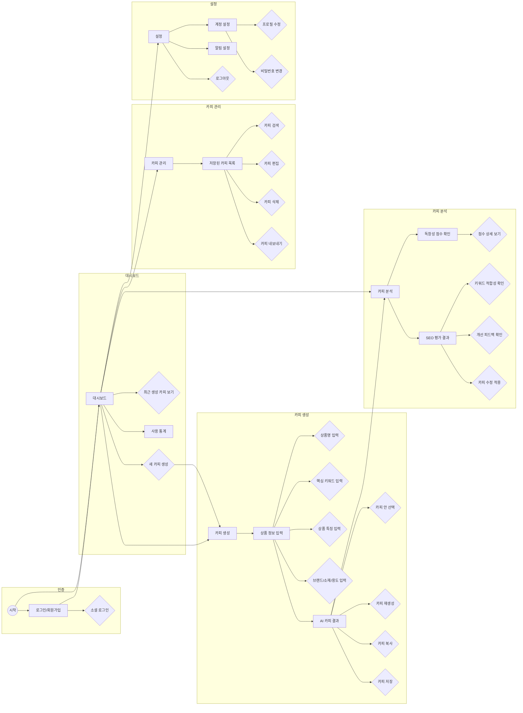

```mermaid
flowchart LR

  subgraph s1 ["인증"]
    n1(("시작"))
    n2["로그인/회원가입"]
    n4{"소셜 로그인"}
  end

  subgraph s2 ["대시보드"]
    n6["대시보드"]
    n7{"새 카피 생성"}
    n8{"최근 생성 카피 보기"}
    n9["사용 통계"]
  end

  subgraph s3 ["카피 생성"]
    n10["카피 생성"]
    n11["상품 정보 입력"]
    n12{"상품명 입력"}
    n13{"핵심 키워드 입력"}
    n14{"상품 특징 입력"}
    n15{"브랜드/소재/용도 입력"}
    n16["AI 카피 결과"]
    n17{"카피 안 선택"}
    n18{"카피 재생성"}
    n19{"카피 복사"}
    n20{"카피 저장"}
  end

  subgraph s4 ["카피 분석"]
    n21["카피 분석"]
    n22["독창성 점수 확인"]
    n23{"점수 상세 보기"}
    n24["SEO 평가 결과"]
    n25{"키워드 적합성 확인"}
    n26{"개선 피드백 확인"}
    n27{"카피 수정 적용"}
  end

  subgraph s5 ["카피 관리"]
    n28["카피 관리"]
    n29["저장된 카피 목록"]
    n30{"카피 검색"}
    n31{"카피 편집"}
    n32{"카피 삭제"}
    n33{"카피 내보내기"}
  end

  subgraph s6 ["설정"]
    n34["설정"]
    n35["계정 설정"]
    n36{"프로필 수정"}
    n37{"비밀번호 변경"}
    n38["알림 설정"]
    n39{"로그아웃"}
  end

  n1 --> n2
  n2 --> n4
  n2 --> n6
  n6 --> n7
  n6 --> n8
  n6 --> n9
  n6 --> n10
  n6 --> n21
  n6 --> n28
  n6 --> n34
  n10 --> n11
  n11 --> n12
  n11 --> n13
  n11 --> n14
  n11 --> n15
  n11 --> n16
  n16 --> n17
  n16 --> n18
  n16 --> n19
  n16 --> n20
  n21 --> n22
  n22 --> n23
  n21 --> n24
  n24 --> n25
  n24 --> n26
  n24 --> n27
  n28 --> n29
  n29 --> n30
  n29 --> n31
  n29 --> n32
  n29 --> n33
  n34 --> n35
  n35 --> n36
  n35 --> n37
  n34 --> n38
  n34 --> n39
  n7 --> n10
  n16 --> n21
  n1 --> n6
```
